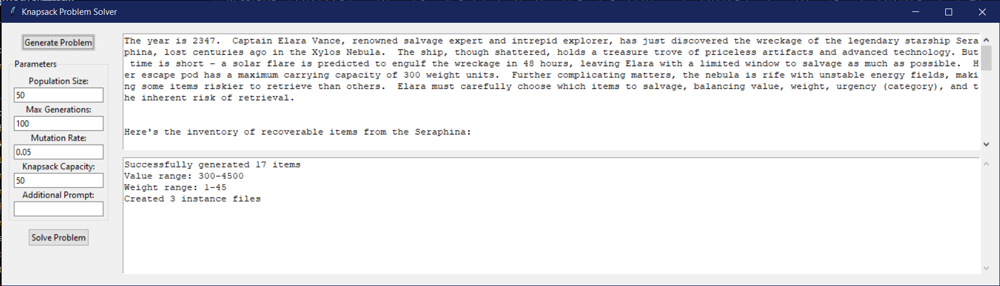
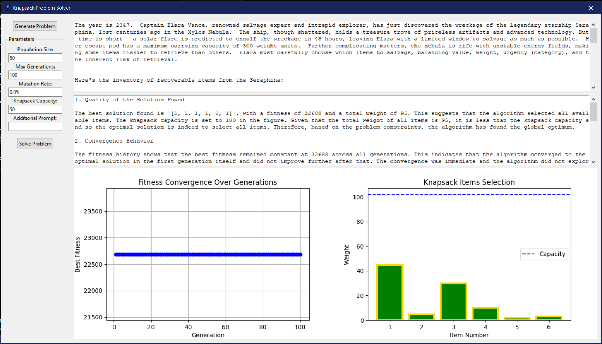
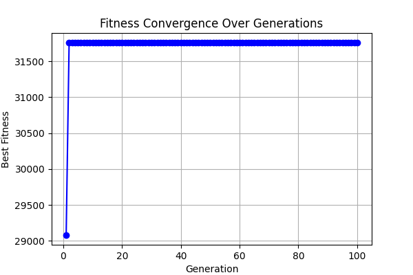
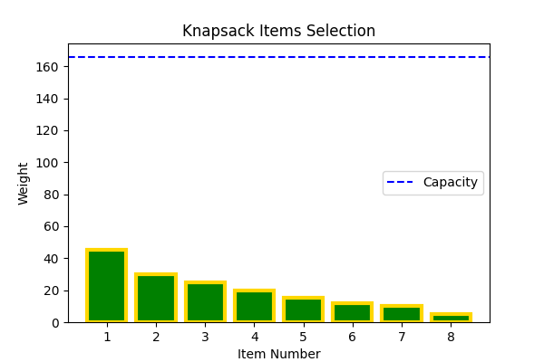

# 🦋 Enhanced Monarch Butterfly Optimization Algorithm with Google Gemini AI Integration

## **Project Overview**
This project combines the Monarch Butterfly Optimization (MBO) algorithm with Google Gemini AI to address optimization problems such as the 0–1 Knapsack Problem. The MBO algorithm is enhanced for binary solutions, with Gemini AI generating problem statements, converting them into knapsack instances, and analyzing results. This integration improves solution quality, adaptability, and convergence rates.

---

## **Features**
- **Google Gemini AI Integration**: Automates problem generation, instance creation, and analytical insights.
- **Enhanced MBO Algorithm**: Tailored for discrete optimization with advanced mutation, migration, and local search.
- **Comprehensive Visualizations**: Includes fitness convergence plots and solution selection charts.
- **Scalable Implementation**: Supports large instances with high efficiency.

---

## **Project Structure**
```
mbo_knapsack_project/
├── mbo_core.py             # Core implementation of the Enhanced MBO algorithm
├── knapsack_problem.py     # Script to run the algorithm on knapsack instances
├── utils.py                # Utility functions for visualization and analysis
├── test_mbo_core.py        # Unit tests for the MBO algorithm
├── data/
│   └── knapsack_instances/ # Folder for knapsack instance files
│       ├── instance1.txt   # Example knapsack problem instance
│       └── ...             # Additional instances
├── results/
│   ├── graphs/             # Directory for output plots (fitness convergence, solutions)
│   └── logs/               # Logs for runtime and results
├── requirements.txt        # Python dependencies
├── LICENSE                 # Project license
└── README.md               # Project overview and instructions
```

---

## **Getting Started**

Feel free to use this project for your first or second-semester college project. Just fork and clone this repo. Here 's a step-by-step guide:

1. **Star the Project**
   - Yes, this is required for the program to function properly. Go ahead, click that star button on GitHub!

2. **Read the Documentation**
   - Make sure to read the `documentation.md` file. It’s crucial to understand how everything works so you can explain it to your teachers and look like a genius.

3. **Prepare Your Presentation**
   - Use the visualizations and results to create a stunning presentation. Your teachers will be amazed at your technical prowess!

## **Installation**
1. **Clone the Repository**
   ```bash
   git clone https://github.com/arkodeepsen/Monarch-Butterfly.git
   cd mbo_knapsack_project
   ```

2. **Create a Virtual Environment**
   ```bash
   python3 -m venv venv
   source venv/bin/activate  # On Windows: venv\Scripts\activate
   ```

3. **Install Dependencies**
   ```bash
   pip install -r requirements.txt
   ```

4. **Set Up Environment Variables**
   - Create a `.env` file in the root directory of the project and add your Google Gemini API key:
      ```
      GEMINI_API_KEY=your_api_key_here
      ```

---

## **Usage**
### **Running the Knapsack Solver**
1. **Prepare Knapsack Instance**
   - Add your instance files in `data/knapsack_instances/` in the format:
     ```
     <capacity>
     <value1> <weight1>
     <value2> <weight2>
     ```

2. **Run the Solver**
   ```bash
   python knapsack_problem.py --instance data/knapsack_instances/instance1.txt --pop_size 50 --max_gen 100 --mutation_rate 0.05
   ```

3. **Parameters**
   - `--instance`: Path to the knapsack instance file.
   - `--pop_size`: Population size (default: 50).
   - `--max_gen`: Number of generations (default: 100).
   - `--mutation_rate`: Mutation probability (default: 0.01).
   - `--save_plots`: Save plots as images in `results/graphs/`.

---
## **Debugging and Manual Execution**
For debugging purposes, you can manually run the solver as described above. However, for a more user-friendly experience, use the `main.py` script which provides a Tkinter-based UI. This interface leverages Google Gemini AI to generate real-world problems, convert them into knapsack instances, and solve them.

### **Running the Tkinter UI**
1. **Execute the Main Script**
   ```bash
   python main.py
   ```

2. **Features of the UI**
   - **Problem Generation**: Automatically generate optimization problems using Google Gemini AI.
   - **Instance Conversion**: Convert generated problems into knapsack instances.
   - **Solution Visualization**: Visualize the solutions and fitness convergence within the UI.




---

## **Example**
```bash
python knapsack_problem.py --instance data/knapsack_instances/instance1.txt --pop_size 50 --max_gen 100 --mutation_rate 0.05 --save_plots
```
- **Output**:
  - Best solution, fitness, and runtime in the terminal.
  - Saved plots: 
    - `fitness_convergence_<instance_name>.png`
    - `knapsack_solution_<instance_name>.png`
    - `solution_plot.png`
    - `fitness_history.png`

---

## **Unit Testing**
Run tests to validate the core functionality:
```bash
python -m unittest test_mbo_core.py
```

---

## **Visualization**
- **Fitness Convergence**: Tracks fitness improvements over generations.



- **Knapsack Solution**: Highlights selected items and their weights.



---

## **Contributing**
Contributions are welcome! Fork the repository, make your changes, and submit a pull request.

---

## **License**
This project is licensed under the MIT License. See the [LICENSE](LICENSE) file for details.

---

## **Acknowledgements**
Special thanks to the authors of the imported modules for their invaluable tools and resources.